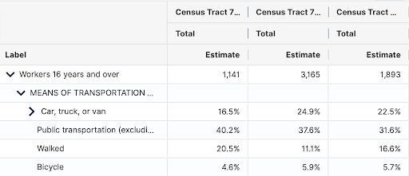
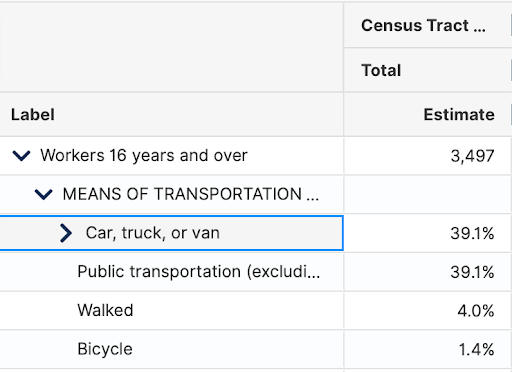
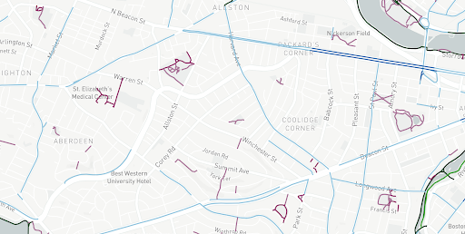
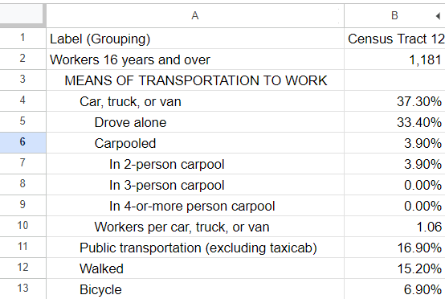
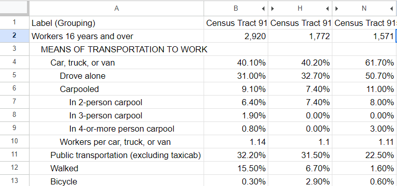
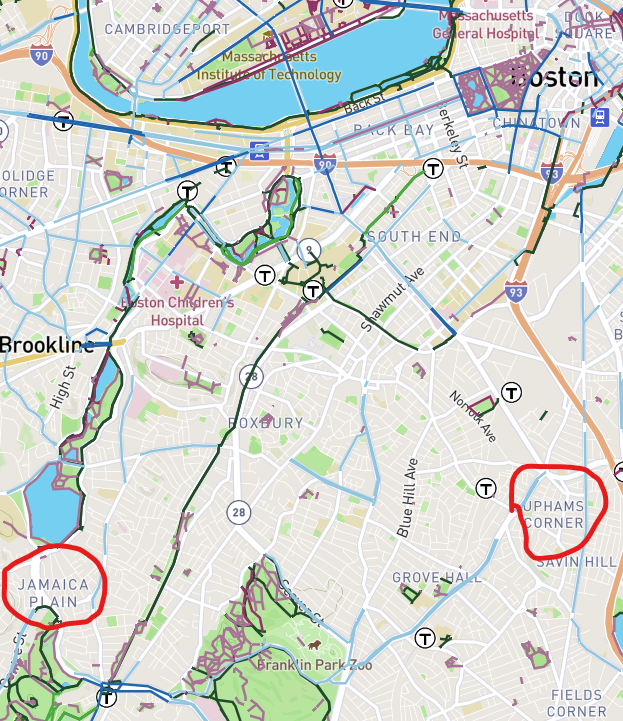

# Bike Lane Connectivity - Early Insights

## Bike Lanes Are Helpful
We know that building more bike lanes increases bicycle traffic and decreases car traffic congestion – this idea is not new. It's why more and more urban areas are proposing and acting on requests for more bike lanes. In metro areas, where the population is dense and space is limited, bikes alongside public transit make much more sense than personal vehicles.

But there is a subset of this idea that is less common, and it’s about the connectedness of said bike lanes. After all, building a bike lane means a lot less when it’s not connected to other bike lanes or places a person would want to be. Boston's local government seems to be aware of this issue, as they have active plans to try to better connect existing bike lanes in their Better Bike Lanes initiative. We still, however, would like to see tangible evidence of bike connectivity correlations with bike commuting and displacement data, and the extent of which they are related. 

This early insight seeks to find trends in bike commute rates in areas with good bike infrastructure and connected bike lanes compared to those with similar-quality bike infrastructure but with less connectivity with Boston’s main bike network.

## Methodology of Early Insight
*Disclaimer: We have NOT ran data through any algorithms or code for this portion of the early insight. All observations were made manually. This is set to change in the future.*

To conduct these observations, we took census tracts of areas with various amounts of bike infrastructure, and used data from the US Census Bureau to find information about the residents of these areas to compare with each other. This early insight will primarily focus on the Suffolk County.

Suffolk Tract Map: https://www2.census.gov/geo/maps/DC2020/PL20/st25_ma/censustract_maps/c25025_suffolk/DC20CT_C25025.pdf
US Census Bureau Data: https://data.census.gov/table
Boston Trailmap (Interactive Map of Bike Lanes): https://trailmap.mapc.org

## Control Group: Suffolk County

As a whole, only 1.8% of all residents surveyed from the Suffolk County are bicycle commuters. We will be using this data point as a baseline for the following areas observed. This could be caused by a myriad of factors:
- Lack of inadequate cycling infrastructure in certain areas
- Distance of commute to workplace being too short or long for cycling
- Convenience of public transit outweighs cycling 
- Likewise, inconvenience of cycling encourages usage of personal vehicles
- And the one we want to observe: **Poor connectivity of Bike Lanes in Bike Network**

## Finding 1: Packard's Corner vs. Aberdeen

*Pictured above from top to bottom: Packard's Corner data (combination of three census tracts), Aberdeen data, geographical map of Packard's Corner and Aberdeen (blue and green lines are bike lanes)*

While Packard’s Corner and Aberdeen are only 1.5 miles apart, nearly 3x as many commuters cycle from Packard’s compared to Aberdeen. We suspect that this is because although both areas have decent bike lane infrastructure, Packard’s is far more connected with the city (the bike lanes go straight from Packard’s all the way to downtown via Comm Ave), while for Aberdeen, you'd have to take an awkward long detour up Cambridge St to have bike lanes throughout the route to downtown. Avoiding this detour would mean going onto a stretch of Comm Ave without bike lanes before hitting Packard's, which discourages bike usage.

We believe this plays a big role in discouraging bike commute in Aberdeen despite having the infrastructure to support cyclists. In fact, a similar trend exists between Jamaica Plains (~6.9% bike commuters) and Upham’s Corner (~1.2% bike commuters) in terms of bike lane connectivity.

## Finding 2: Jamaica Plains and Upham's Corner

*Pictured above from top to bottom: Jamaica Plains data, Upham's Corner data (combination of three census tracts), geographical map of Jamaica Plains and Upham's Corner (blue and green lines are bike lanes)*

Jamaica Plains and Upham's Corner have similar correlations. While Upham's Corner has a bike lane on Dorchester Ave that spans all the way to downtown, it has areas where the bike lanes disappear. Coupling on to an easy access to the Orange Line, and Upham's Corner has a lower-than-average bike commuter percentage than all of Suffolk. Meanwhile, Jamaica Plains is even further from downtown than Upham's Corner, but manages to have nearly four times the amount of bike commuters than Suffolk's average -- even with great T access (which competes against cycle commutes!). This is supported by a well-connected bike network to downtown.

## Acknowledging Outside Factors
While we feel pretty strongly about the conclusion drawn on the previous sections, we also acknowledge that outside, unrelated factors may play a part in the offset cycling rate in the two pairs of neighborhoods, such as:
- Difference of difficulty in storing a personal vehicle between the neighborhoods
- Difference of distance of commutes between the neighborhoods
- Difference of income brackets of residents between the neighborhoods
- etc.

We hope to find stronger evidence to back up these correlations in the future of this project.